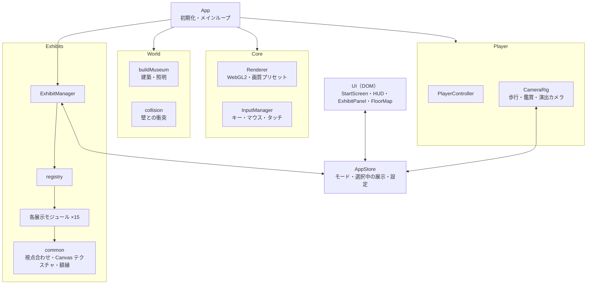
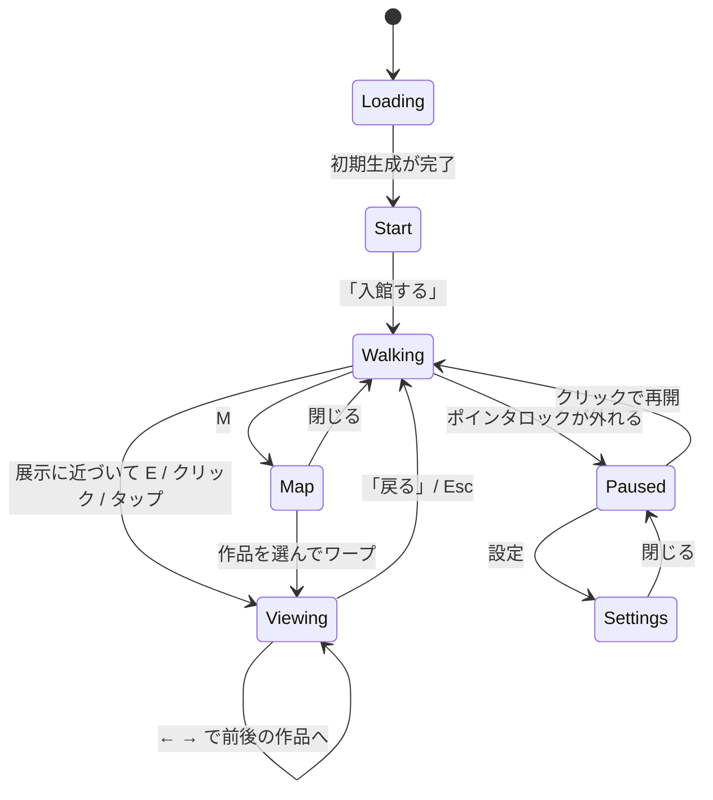
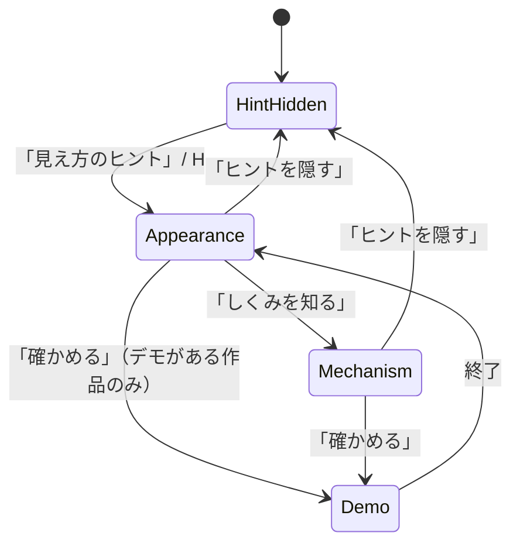
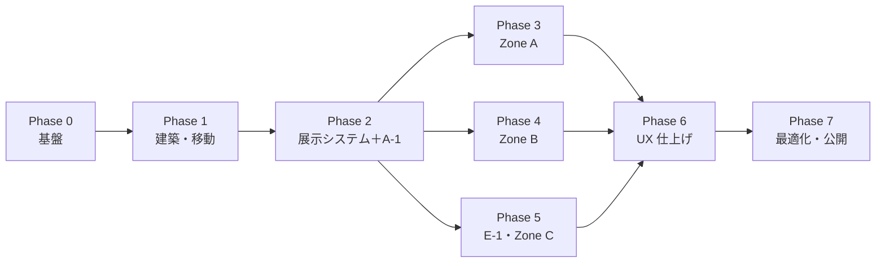

# Optical Illusion Museum 実装計画書

| 項目 | 内容 |
|---|---|
| 元資料 | [PLAN.md](./PLAN.md) |
| 版 | 1.0（2026-09-23） |
| 状態 | ドラフト（レビュー待ち） |

---

## 1. 概要

### 1.1 コンセプト

ブラウザで動く 3D の「錯視美術館」をつくる。来館者は近代的な美術館の中を歩き、錯視（Optical Illusion）をテーマにした展示を見て楽しむ。
各展示の「見え方のヒント」は最初は隠れている。ボタンを押すと、その作品がどう見えるか、なぜそう見えるかの説明を読める。

### 1.2 要件の分解

| ID | 要件 | 出典 | 本計画での対応 |
|---|---|---|---|
| R1 | ブラウザ上で動作する 3D シーン | PLAN | Three.js（WebGL2）＋ Vite の静的 Web アプリ。インストール不要 |
| R2 | 錯視をテーマにした展示を鑑賞して楽しむ | PLAN | 館内を自由に歩く「歩行モード」と、推奨視点にカメラを合わせる「鑑賞モード」 |
| R3 | ヒントは非表示。ボタンで見え方の説明を表示 | PLAN | 作品パネルの「見え方のヒント」ボタン（初期は閉じた状態）＋ 3D の種明かしデモ |
| R4 | 近代的な美術館 | PLAN | ホワイトキューブ、コンクリート、天窓を使ったモダン建築 |
| R5 | オリジナルを含めて 10 を超える展示 | PLAN | 全 15 展示（うちオリジナル 4）。優先度 Must だけで 11 展示 |
| N1 | 一般的なノート PC で快適に動く | 派生 | 60fps 目標、画質プリセット |
| N2 | スマートフォンでも鑑賞できる | 派生 | タッチ操作、レスポンシブ UI |
| N3 | 安全・快適に鑑賞できる | 派生 | 光過敏・映像酔いの注意喚起、「動きを減らす」設定 |

### 1.3 完成の定義（受け入れ基準）

- [ ] デスクトップの Chrome / Edge / Firefox / Safari 最新版で、入館してから全展示を鑑賞し、ヒントを表示するまでの流れが完結する
- [ ] 展示が 11 点以上あり、どの展示にもヒント（見え方・しくみ）がある
- [ ] どの展示でもヒントは初期状態で非表示で、ボタン操作でのみ表示される
- [ ] 中位ノート PC（内蔵 GPU）の 1080p で平均 55fps 以上
- [ ] 単体テストと E2E テストが CI で成功する
- [ ] 静的ホスティングに公開できる

---

## 2. 前提と仮定

Docs/PLAN.md に書かれていない事項は、次のように仮定した。違う場合は本書を更新する。

- `.gitignore` に `dist/`、`*.local`、`playwright-report/` などがあるので、ビルドは Vite、E2E テストは Playwright を使う
- `Docs/screenshots/` は、Playwright で撮る確認用スクリーンショットの出力先とする（git 管理外）
- 言語は日本語。作品タイトルには英題を併記する。多言語化は拡張扱い
- バックエンドはない（静的サイト）。鑑賞履歴などはブラウザの localStorage にだけ保存する
- 展示物の 3D 形状とテクスチャは、原則としてコードで手続き生成する。外部アセットに頼らないことで、著作権のリスクと容量を抑える
- 有名な既存作品（特定の画像や立体作品）は複製しない。錯視の「原理」に基づいて図柄と形状を独自に設計する

---

## 3. 技術スタック

| 分類 | 採用 | 理由 |
|---|---|---|
| 言語 | TypeScript（strict） | 展示が多いので、共通インターフェースを型で保証する |
| ビルド | Vite | 高速な HMR、静的ビルド、GLSL を `?raw` で import できる |
| 3D | Three.js（WebGLRenderer / WebGL2） | 実績と資料が多い。`Reflector`、`PointerLockControls` などの拡張がそろっている |
| UI | 素の DOM ＋ CSS（フレームワークなし） | UI はパネル数枚だけなので、依存を減らしてバンドルを軽くする |
| 単体テスト | Vitest | Vite と設定を共有できる |
| E2E | Playwright | WebGL を含む画面を検証し、スクリーンショットを撮る |
| 品質管理 | ESLint ＋ Prettier ＋ `tsc --noEmit` | |
| 開発補助 | lil-gui、stats.js（開発時のみ） | 視点・線幅・照明をその場で調整する |
| 配信 | GitHub Pages（または Cloudflare Pages） | 静的ファイルだけで完結する |

- 各ライブラリのバージョンは Phase 0 時点の最新安定版に固定する（`package-lock.json`）。Node.js は LTS 版を使う
- WebGPURenderer は互換性を優先して採用しない

---

## 4. システム設計

### 4.1 全体構成



1 フレームの処理は次の順に行う。

1. `InputManager` → `PlayerController`（移動と衝突判定）
2. `CameraRig`（歩行・鑑賞・デモ演出の間でカメラを補間する）
3. `ExhibitManager.update`（近くにある展示を検出し、アクティブな展示だけ `update` する）
4. `renderer.render`
5. UI 更新（状態が変わったときだけ）

### 4.2 ディレクトリ構成

```
.
├─ index.html
├─ public/                    favicon、OGP 画像
├─ src/
│  ├─ main.ts
│  ├─ app/
│  │  ├─ App.ts               初期化・メインループ
│  │  ├─ store.ts             アプリ状態（モード、選択中の展示、設定）と購読
│  │  └─ debugApi.ts          テスト用の window.__OIM__（開発・テスト時のみ）
│  ├─ core/
│  │  ├─ renderer.ts          WebGLRenderer の設定・画質プリセット
│  │  ├─ loop.ts
│  │  └─ input.ts             キーボード・マウス・タッチの抽象化
│  ├─ world/
│  │  ├─ layout.ts            部屋・壁・開口部・展示配置の宣言的データ
│  │  ├─ buildMuseum.ts       layout から建築メッシュを生成
│  │  ├─ materials.ts         床・壁・木材などの共通マテリアル
│  │  ├─ lighting.ts
│  │  └─ collision.ts         2D の壁との衝突・スライド
│  ├─ player/
│  │  ├─ PlayerController.ts
│  │  └─ CameraRig.ts
│  ├─ exhibits/
│  │  ├─ types.ts             Exhibit インターフェース
│  │  ├─ registry.ts          展示 ID → ファクトリ
│  │  ├─ ExhibitManager.ts    近接判定・アクティブ化・ヒントとデモの連携
│  │  ├─ common/
│  │  │  ├─ viewpoint.ts      視点合わせの数学（§4.7）
│  │  │  ├─ ProjectorMaterial.ts
│  │  │  ├─ canvasTexture.ts  Canvas → Texture（解像度・異方性フィルタ）
│  │  │  ├─ frame.ts          額縁・台座
│  │  │  └─ caption.ts        壁面キャプションプレート
│  │  ├─ a1-cafe-wall/
│  │  │  ├─ index.ts          3D 化・ヒント演出
│  │  │  └─ pattern.ts        図形データを返す純粋関数
│  │  └─ …                    展示ごとに 1 ディレクトリ（<番号>-<id>）
│  ├─ content/
│  │  └─ exhibits.ja.ts       タイトル・鑑賞のしかた・ヒント文（型付き）
│  ├─ ui/
│  │  ├─ StartScreen.ts       館名・注意事項・操作説明・「入館する」
│  │  ├─ Hud.ts               クロスヘア・近接プロンプト・ゾーン名
│  │  ├─ ExhibitPanel.ts      作品情報＋ヒント（初期は非表示）
│  │  ├─ FloorMap.ts
│  │  ├─ SettingsPanel.ts
│  │  └─ TouchControls.ts     バーチャルスティック
│  ├─ shaders/                共通 GLSL
│  └─ styles/
├─ tests/
│  ├─ unit/
│  └─ e2e/
└─ Docs/
   ├─ PLAN.md
   └─ IMPLEMENTATION_PLAN.md
```

URL パラメータ:

- `?exhibit=<id>`: その作品の鑑賞モードを直接開く（共有・テスト用）
- `?quality=low|medium|high`: 画質を指定する
- `?debug`: stats.js と lil-gui を表示する

### 4.3 状態遷移



鑑賞モードの中でのヒントの状態:



### 4.4 展示モジュールのインターフェース

展示は位置に依存しないモジュールとして作る。ワールド上の位置と向きは `layout.ts` で与えるので、配置の入れ替えはデータの変更だけで済む。

```ts
export type ViewMode =
  // 作品の正面に立って見る（平面作品）
  | { kind: 'front'; distance: number }
  // 視点を固定して見る（視点に依存する作品）。allowShift は左右にずらせる上限（m）
  | { kind: 'fixed'; position: Vec3; target: Vec3; fov: number; allowShift?: number };

export interface ExhibitContext {
  renderer: THREE.WebGLRenderer;
  camera: THREE.PerspectiveCamera;
  quality: 'low' | 'medium' | 'high';
  reducedMotion: boolean;
}

export interface Exhibit {
  readonly id: ExhibitId;
  readonly root: THREE.Object3D;          // 展示の 3D オブジェクト（ローカル座標）
  readonly viewMode: ViewMode;            // 鑑賞モードのカメラ（展示ローカル座標）
  init(ctx: ExhibitContext): Promise<void>;       // テクスチャ生成などの重い処理
  update?(dt: number, ctx: ExhibitContext): void; // アクティブなときだけ呼ばれる
  setHintVisible?(visible: boolean): void; // 3D 側のヒント表現（ガイド線など）
  playDemo?(): Promise<void>;             // 種明かしデモ
  stopDemo?(): void;
  onEnterView?(): void;
  onExitView?(): void;
  dispose(): void;
}
```

### 4.5 展示コンテンツのデータ構造

文言は `src/content/exhibits.ja.ts` に型付きで集約し、実装コードと分ける。

```ts
export interface ExhibitContent {
  id: ExhibitId;                 // 'cafe-wall'
  number: string;                // 'A-1'
  zone: 'entrance' | 'plane' | 'spatial' | 'original';
  kind: 'classic' | 'original';
  title: string;
  titleEn: string;
  credit?: string;               // 発見者・年（classic のみ）
  howToView: string;             // 鑑賞のしかた（常に表示。見え方は書かない）
  hint: {
    appearance: string;          // どう見える？（「見え方のヒント」で表示）
    mechanism: string;           // なぜ？（「しくみを知る」で表示）
  };
  demoLabel?: string;            // 「ガイド線を重ねる」など
  caution?: string;              // 光過敏などの個別注意
}
```

記述例:

```ts
{
  id: 'cafe-wall',
  number: 'A-1',
  zone: 'plane',
  kind: 'classic',
  title: 'カフェウォール錯視',
  titleEn: 'Café Wall Illusion',
  credit: 'R. L. Gregory & P. Heard (1979)',
  howToView: '少し離れたところから、作品全体を眺めてください。',
  hint: {
    appearance: '灰色の横線が、交互に右上がり・右下がりに傾いて見えます。',
    mechanism: '横線はすべて水平で平行です。白と黒のタイルが半分ずつずれ、…',
  },
  demoLabel: 'ガイド線を重ねる',
}
```

執筆ルール:

- `howToView` には見え方を書かない（ネタバレ防止）
- 見え方には個人差があることを `appearance` に添える（例:「見えにくい場合は、少し離れてみてください」）

### 4.6 錯視を壊さないための描画方針

平面の錯視は、3D 空間の中に置くと効果が弱まりやすい。次の方針で防ぐ。

1. **作品面の色を正確に出す**: 作品面は `MeshBasicMaterial` ＋ `toneMapped: false`、テクスチャは `SRGBColorSpace` にする。トーンマッピング（ACES）は建築部分だけにかける
2. **解像度を確保する**: Canvas テクスチャは高画質なら 2048px、低画質なら 1024px で生成する。ミップマップと最大の異方性フィルタを使う。細い線の作品は、鑑賞モードでの画面上のピクセル数を基準に線幅を決める
3. **正面から見る**: 平面作品は、鑑賞モードで額の正面、画面の約 70% を占める距離にカメラを動かす。斜めから見ることによる歪みやモアレを避ける
4. **視点に依存する作品は視点を固定する**: 固定視点と狭い FOV（望遠）で透視の歪みを抑え、設計した視点と実際のカメラ位置を正確に一致させる
5. **ポストエフェクトを使わない**: ブルームやビネットは輝度の関係を崩すので使わない。アンチエイリアスは MSAA だけにする
6. **作品面に照明を当てない**: スポットライトの効果は額縁と壁だけに当て、作品面の画素値は変えない

### 4.7 共通技術: 視点合わせ

「特定の位置 P から見たときだけ X に見える」作品が多い。その数学を `src/exhibits/common/viewpoint.ts` にまとめる。

| 手法 | 内容 | 使う展示 |
|---|---|---|
| 光線上配置 | 2D の断片を、P から見た方向を保ったまま異なる距離 d に置き、d/d₀ 倍に拡大する | B-2、C-3 |
| 射影テクスチャ | P に置いた仮想プロジェクタのビュー射影行列を使い、任意の面に画像を「投影」して描く（シェーダ） | E-1 |
| 透視的共線変換（ホモロジー） | 頂点 v を `v' = P + (v − P) / (a·(v − P) + b)` で写す。P からの見た目を変えずに、平面を平面のまま保つ | B-1 |
| 2 視点同時拘束 | 2 方向から投影した像が、それぞれ指定した曲線になる空間曲線を解く | C-1 |

単体テストで「P から再投影した像が元の 2D 図形と一致する（誤差 1e-6 未満）」ことを確かめる。

---

## 5. 美術館の空間設計

### 5.1 デザインコンセプト

- 白い壁（ホワイトキューブ）、磨いたコンクリートの床、オーク材のベンチ、黒いスチールの手すり
- 天窓（トップライト）からの柔らかな自然光と、作品を照らすスポットライト
- サインは最小限にする。ゾーン名は壁に大きく、作品番号とキャプションは小さなプレートで示す
- 推奨視点は床の「ここから見る」マークで示す。歩行モードでも、マークに立てば視点に依存する錯視が成立する
- スケールは 1 ユニット = 1m、目の高さは 1.6m
- 外観は作り込まない。ガラス越しに見える空（グラデーション）と地面だけを用意する

### 5.2 フロアプラン

```
                    +--------------------------------+
                    |  Zone C : Original Room        |
                    |                      +-------+ |
                    |   [C-1]    [C-3]     |  C-2  | |
                    |                      +-------+ |
                    +---------------+----------------+
                                    |  corridor
+------------------------+   +------+---------+   +---------------------------+
| Zone A : Plane Gallery |   |  Central Hall  |   | Zone B : Spatial Hall     |
|                        |   |                |   |  +-------+                |
|  [A-1]  [A-2]  [A-3]   +---+     [E-1]      +---+  |  B-1  |  [B-2]  [B-3]  |
|                        |   |                |   |  +-------+                |
|  [A-4]  [A-5]  [A-6]   |   |                |   |  [B-4]          [B-5]     |
+------------------------+   +-------+--------+   +---------------------------+
                                     |
                                  Entrance
```

| エリア | 寸法（幅 × 奥行 × 天井高） | 特徴 |
|---|---|---|
| 中央ホール | 20 × 16 × 8 m | 吹き抜けと天窓、受付カウンター、E-1 |
| Zone A 平面錯視ギャラリー | 30 × 12 × 4.5 m | 壁に額装した作品、中央にベンチ |
| Zone B 立体錯視ホール | 24 × 24 × 6 m | 台座の上の立体作品、B-1 は箱型ブース |
| Zone C オリジナル展示室 | 20 × 14 × 5 m | ガラス面から外光が入る。C-2 は暗室 |
| 通路・回廊 | 幅 4 m | 各ゾーンの入口にゾーンサイン |

推奨の順路: 入口 → 中央ホール（E-1）→ Zone A → Zone B → Zone C

---

## 6. 展示計画

### 6.1 展示一覧

区分の定義:

- **古典**: 既知の錯視を、その原理に基づいて独自に作画・造形したもの
- **オリジナル**: 本美術館のために設計した新作。3D 空間ならではの体験にする

規模の目安（1 人で作業した場合）: S = 1 日以内、M = 2〜3 日、L = 4 日以上

| No. | ID | 作品名 | 区分 | 主な実装技術 | 鑑賞モード | 優先度 | 規模 |
|---|---|---|---|---|---|---|---|
| E-1 | `welcome-anamorphosis` | ようこそ（アナモルフォーシス） | オリジナル | 射影テクスチャ | 固定 | Must | M |
| A-1 | `cafe-wall` | カフェウォール錯視 | 古典 | Canvas2D | 正面 | Must | S |
| A-2 | `ebbinghaus` | エビングハウス錯視 | 古典 | Canvas2D | 正面 | Must | S |
| A-3 | `muller-lyer` | ミュラー・リヤー錯視 | 古典 | Canvas2D | 正面 | Should | S |
| A-4 | `scintillating-grid` | きらめき格子錯視 | 古典 | Canvas2D | 正面 | Must | S |
| A-5 | `peripheral-drift` | 周辺ドリフト錯視 | 古典（図柄は独自） | Canvas2D | 正面 | Must | M |
| A-6 | `afterimage` | 残像の窓 | 古典 | GLSL ＋ タイマー | 正面・対話 | Must | M |
| B-1 | `ames-room` | エイムズの部屋 | 古典 | ホモロジー変換 | 固定（覗き穴） | Must | L |
| B-2 | `impossible-triangle` | ペンローズの三角形 | 古典 | 光線上配置 | 固定 | Must | M |
| B-3 | `checker-shadow` | チェッカーシャドウ（立体版） | 古典 | 非照明マテリアル ＋ 陰影の焼き込み | 固定 | Must | M |
| B-4 | `reverspective` | 逆遠近（リバースペクティブ） | 古典（図柄は独自） | 手続き形状 ＋ Canvas | 固定・横ずらし | Should | M |
| B-5 | `shadow-spinner` | 回る影（シルエット錯視） | 古典 | 正射影レンダーターゲット | 正面 | Should | M |
| C-1 | `circle-heart` | 円とハートのあいだ | オリジナル | 2 視点同時拘束曲線 ＋ 鏡（Reflector） | 固定 | Must | L |
| C-2 | `colorless-fruit` | 色のない果実 | オリジナル | 色付き照明 ＋ ピクセル採取 | 固定・対話 | Must | M |
| C-3 | `invisible-triangle` | 見えない三角形 | オリジナル | 光線上配置（主観的輪郭） | 固定 | Should | S |

- Must: 11 展示（うちオリジナル 3）。これだけで R5（10 を超える展示、オリジナルを含む）を満たす
- Should: 4 展示。すべてそろえば全 15 展示
- 発見者・年などの出典は、Phase 6 で一次資料にあたって確認する

### 6.2 各展示の仕様

各展示について「見え方」「実装」「ヒント演出（3D 側の種明かし）」「注意」を書く。

#### E-1 ようこそ（アナモルフォーシス） — 中央ホール

- **見え方**: 入口正面の床マークから見ると、壁・柱・床・吊り下げたパネルにまたがって描かれた断片が、1 枚の美術館ロゴ（目のシンボルと館名）に見える
- **実装**: `ProjectorMaterial` を作る。P に置いた仮想プロジェクタのビュー射影行列を uniform で渡し、フラグメントのワールド座標から UV を計算してロゴテクスチャを読む。投影するのはロゴ用に指定したメッシュだけにする。遮蔽は配置の工夫で避け、必要ならプロジェクタの深度マップで判定する
- **ヒント演出**: 「確かめる」でカメラを P から横へ 3m 動かし、断片がばらばらだと見せてから戻る
- **備考**: 入館して最初の体験になる。開始時のカメラを P の近くに置き、来館者が自分で「見つける」導入にする

#### A-1 カフェウォール錯視

- **見え方**: 水平な灰色の線が、交互に傾いて（くさび形に）見える
- **実装**: 白黒のタイルを半分ずつずらした行と、灰色の目地線を Canvas に描く
- **ヒント演出**: 赤い水平ガイド線を重ねて、線が平行だと示す。行のずれをアニメーションで 0 にすると、傾きが消える

#### A-2 エビングハウス錯視

- **見え方**: 大きな円に囲まれた中央の円が、小さな円に囲まれた中央の円より小さく見える
- **実装**: Canvas2D。2 つの中央円は同じ半径にする
- **ヒント演出**: 周りの円をフェードアウトし、中央の円どうしを並べる

#### A-3 ミュラー・リヤー錯視

- **見え方**: 外向きの矢羽がついた線分が、内向きの矢羽がついた線分より長く見える
- **実装**: Canvas2D
- **ヒント演出**: 矢羽を消し、同じ長さの定規（バー）を重ねる

#### A-4 きらめき格子錯視

- **見え方**: 格子の交点にある白い円に、黒い点がちらついて見える。注視している交点には現れない
- **実装**: 黒地に灰色の格子線を引き、交点に白い円を置く。線幅と円の直径の比が効果を左右するので、鑑賞距離での画面上のサイズを基準に lil-gui で調整する
- **ヒント演出**: 交点を 1 つ拡大して、黒い点が描かれていないことを示す
- **注意**: ちらつく感覚があるので、注意書きを表示する

#### A-5 周辺ドリフト錯視

- **見え方**: 静止画なのに、円環がゆっくり回転しているように見える。視線を動かすと強まる
- **実装**: 「黒 → 濃い灰 → 白 → 淡い灰」の輝度の段階を繰り返す要素を、円環状に並べる。配置と配色は独自にデザインする
- **ヒント演出**: 一部を拡大して輝度の並び順を示す。並び順を入れ替えると効果が消えることを見せる
- **注意**: 既存の有名作品（北岡明佳氏の「蛇の回転」など）の画像は使わない。ちらつきの注意書きを表示する

#### A-6 残像の窓

- **見え方**: 補色で描かれた風景の中央の点を約 20 秒見つめたあと、白黒の画像に切り替わると、一瞬カラーに見える
- **実装**: 手続き生成した風景（空・太陽・花など）を Canvas に描き、シェーダで補色版と白黒版を切り替える。鑑賞モードで「はじめる」を押すと、円形のカウントダウンのあと自動で切り替わる
- **ヒント演出**: 残像のしくみ（錐体の順応）を図と文で説明する
- **注意**: `prefers-reduced-motion` のときも利用できる（切り替えは 1 回だけ）

#### B-1 エイムズの部屋

- **見え方**: 覗き穴から見ると普通の四角い部屋なのに、左右の隅に立つ同じ大きさの人形が、極端に違う大きさに見える
- **実装**: 普通の直方体の部屋（市松模様の床、窓）を作り、覗き穴 P を中心とするホモロジー `v' = P + (v − P) / (a·(v − P) + b)` で全頂点を写す。奥の壁が斜めの歪んだ部屋になるが、P からの見た目は変わらない（領域内で `a·(v − P) + b > 0` を保つ）。人形はカプセルなどで組んだ同じモデルを使い、置く位置だけ変える
- **ブース**: 外から見ると箱型の小部屋。正面の覗き穴に近づくと鑑賞モードになり、視点を P に固定する（FOV を狭くし、移動はできない）
- **ヒント演出**: 「確かめる」でカメラが覗き穴から上へ抜け、天井を透過して部屋の本当の形を上から見せる。人形の左右を入れ替えるアニメーションもつける
- **テスト**: 写像の前後で P からの投影座標が一致すること、各面が平面のままであること

#### B-2 ペンローズの三角形

- **見え方**: 3 本の角材が互いに直角につながった「ありえない三角形」の彫刻に見える
- **実装**: 3 本の角材を x・y・z 方向に開いた経路として配置し、光線上配置で P から見て両端が重なるように調整する。重なる部分は角材の端面を斜めに切り、つながっているように見せる
- **ヒント演出**: カメラを横に回り込ませ、実は途切れていることを見せる
- **備考**: 台座の周りを歩けるので、歩行モードでも自分で種を見つけられる

#### B-3 チェッカーシャドウ（立体版）

- **見え方**: 円柱の影がかかった市松模様の盤で、影の中の「明るいマス」A と、影の外の「暗いマス」B の明るさがまったく違って見える
- **実装**: 盤と円柱を `MeshBasicMaterial`（`toneMapped: false`）で描く。陰影はライティングで計算せず、事前に計算して頂点カラーとテクスチャに焼き込む。これで A と B の画素値を完全に一致させる（例: sRGB `#787878`）。陰影は拡散成分だけにし、視点が変わっても同じ値を保つ
- **ヒント演出**: A と B の間に同じ色の帯を出してつなぐ。A と B 以外を暗転させる
- **テスト**: E2E で A と B の中心の画素値を読み取り、一致を確かめる

#### B-4 逆遠近（リバースペクティブ）

- **見え方**: 壁から突き出た立体に描かれた街並みが、見る位置を横に動かすと、こちらの動きを追うように大きく動く
- **実装**: 手前に突き出した角錐台（凸形状）を並べ、各面に奥へ消えていく街路や建物を描く。いちばん手前の面に消失点側を描くのがポイント。形状は手続き生成、絵は Canvas で描く
- **鑑賞モード**: 視点を固定し、左右に ±1.5m ずらせるようにする（A/D キーまたはドラッグ）
- **ヒント演出**: 真横からのカメラに切り替えて、実は凸形状だと見せる。ワイヤーフレーム表示もつける

#### B-5 回る影（シルエット錯視）

- **見え方**: 回転する人型の影が、右回りにも左回りにも見える。見ているうちに回転の向きが反転する
- **実装**: カプセルで組んだ片足立ちの人型をターンテーブルで回し、正射影カメラでレンダーターゲットに黒一色で描く。それを背後から光を当てた「影絵スクリーン」の面に表示する
- **ヒント演出**: 足元だけに陰影をつけて奥行きの手がかりを与え、本当の回転方向を示す。向きを切り替えて見るコツも説明する
- **性能**: レンダーターゲットは 512px にし、近くにいるときと鑑賞中だけ更新する
- **出典**: 茅原伸幸氏のシルエット錯視（2003）で広く知られる現象。人型は独自にモデリングする

#### C-1 円とハートのあいだ

- **見え方**: 台座の上の筒を直接見ると、縁が「円」に見える。後ろの鏡に映った姿は「ハート」に見える
- **実装**: 筒の上縁を「視点 A から見ると円、鏡越し（反対側の視点 B）から見るとハート」になる空間曲線として計算する。正射影で近似し、俯角を θ とすると、横位置 x ごとに次の関係がある
  - A から見た像の高さ: `v_A = y·sinθ + z·cosθ`
  - B から見た像の高さ: `v_B = −y·sinθ + z·cosθ`
  - 奥側の縁は「A の像の上側の曲線」と「B の像の下側の曲線」を同時に満たし、手前側の縁はその逆の組を満たす。したがって `z = (v_A + v_B) / (2cosθ)`、`y = (v_A − v_B) / (2sinθ)`
  - 円とハートは左右対称にし、横幅をそろえる（左右対称なので、B 側の左右反転は問題にならない）
  - 筒の側面は、上縁から真下に下ろす
- **鏡**: three.js の `Reflector` を使う。解像度は画質設定に連動させ、Zone C にいるときだけ有効にする
- **鑑賞モード**: 視点を遠めに固定し、FOV を狭くして正射影近似とのずれを抑える
- **ヒント演出**: 筒をターンテーブルで 180° 回すと、実物側がハートに、鏡側が円に入れ替わる。真上から見た本当の形も表示する
- **テスト**: 視点 A と B に再投影した曲線が、それぞれ円とハートに許容誤差内で一致すること。縁が自己交差しないこと

#### C-2 色のない果実

- **見え方**: シアン色の照明に満たされた小部屋のテーブルに、赤いイチゴとリンゴが載っているように見える。しかし画面には「赤い」ピクセルが 1 つもない
- **実装**: 暗室全体をシアン系の単色光で照らす（環境光と環境マップも同じ色にする）。果実のアルベドは赤にし、果実の部分がほぼ無彩色の灰色になるよう、光の色とアルベドを調整する
- **対話**: 「スポイト」ツール。画面をクリックすると、その点の実際の画素の色（RGB と色見本）を表示する（`readRenderTargetPixels`）
- **ヒント演出**: 照明を白色に切り替えて比べる。画面全体を走査して「赤いピクセル: 0 個」と表示する
- **出典**: 色の恒常性（北岡明佳氏の「赤くないイチゴ」の画像で広く知られる）。その画像そのものは使わない
- **テスト**: E2E で果実の領域に R 成分が優位な画素がないことを確かめる

#### C-3 見えない三角形

- **見え方**: 床マークから見ると、空間に白い三角形が浮かんで見える。輪郭線が見え、周りより明るく感じる。しかし三角形はどこにも描かれていない
- **実装**: 欠けた円盤（パックマン形）3 枚と V 字のパーツ 3 つを異なる奥行きに吊るし、光線上配置で P から見たときだけカニッツァの三角形の配置になるようにする。背景は白い壁にする
- **ヒント演出**: カメラを回り込ませ、パーツが空間にばらばらに浮いていることを見せる

---

## 7. UI/UX 設計

### 7.1 操作

| 操作 | デスクトップ | モバイル |
|---|---|---|
| 移動 | WASD / 矢印キー（Shift で早歩き） | 左下のバーチャルスティック |
| 視点 | マウス（ポインタロック） | 画面の右半分をドラッグ |
| 鑑賞する | 展示に近づいて E / 展示をクリック | 展示をタップ / 「鑑賞する」ボタン |
| ヒントを表示 | ボタン / H | ボタン |
| 鑑賞をやめる | 「戻る」/ Esc / Q | 「戻る」 |
| 前後の作品 | ← / → | ボタン |
| フロアマップ | M | マップボタン |

移動は歩行速度 1.4m/s、早歩き 2.5m/s を目安にする。加速と減速はなめらかにし、ヘッドボブはつけない。

### 7.2 鑑賞の流れとヒント表示（R3 の詳細）

```
[歩行モード] 展示に近づく（3m 以内で、展示のほうを向いている）
   ↓ 「E: 鑑賞する」のプロンプトを表示
[鑑賞モード] カメラが推奨視点へ 0.8 秒で移動 / ポインタロックを解除
   ├─ 作品パネル: 作品番号・タイトル・英題・区分・鑑賞のしかた
   ├─ ▶ 見え方のヒント   … 初期状態は閉じている（ネタバレ防止）
   │     └─ 開くと「どう見える？」を表示
   │         ├─ ▶ しくみを知る … さらに開くと「なぜ？」を表示
   │         └─ [確かめる]    … 3D の種明かしデモ（対応する作品のみ）
   └─ [戻る]  [← 前の作品]  [次の作品 →]
```

- ヒントは、鑑賞モードに入るたびに閉じた状態から始まる。再訪したときも同じ。ただし「ヒント閲覧済み」の印は残す
- ヒントのボタンは `<button aria-expanded>` と `aria-controls` で作り、キーボードとスクリーンリーダーで操作できるようにする
- ヒントを表示している間も作品が見えるようにパネルを置く（デスクトップは右側に幅 360px、モバイルは下部シートで高さ 45% まで）
- 3D の壁にも作品のキャプション（番号・タイトル）を Canvas テクスチャで置く。雰囲気づくり用で、ヒントは含めない
- ポインタロック中は DOM のボタンを押せないので、ボタン操作は鑑賞モード（ロック解除中）で行う設計にする

### 7.3 画面一覧

| 画面 | 内容 |
|---|---|
| ローディング | 進捗バー |
| スタート | 館名、注意事項（光過敏・映像酔い）、操作説明、「入館する」 |
| HUD | クロスヘア、近接プロンプト、現在のゾーン名、マップと設定のボタン |
| 作品パネル | §7.2 のとおり |
| フロアマップ | ゾーン、作品の位置、鑑賞済みの印。作品を選ぶとその鑑賞モードへワープ |
| 設定 | 画質（低・中・高・自動）、マウス感度、視野角、上下反転、動きを減らす |
| 一時停止 | ポインタロックが外れたときに表示。クリックで再開 |

### 7.4 安全とアクセシビリティ

- スタート画面と該当する作品（A-4、A-5、B-4 など）に、光過敏性と映像酔いの注意を表示する
- 視野角を調整できるようにする。`prefers-reduced-motion` を初期値に反映し、カメラの移動演出をフェードに置き換える
- UI はすべてキーボードで操作でき、文字のコントラスト比は 4.5:1 以上にする
- 錯視の見え方には個人差があることをヒント文に書く（「見えなくても異常ではありません」）

---

## 8. 実装フェーズ



Phase 3〜5 の展示モジュールは互いに独立しているので、Phase 2 のあとは並行して進められる。

| マイルストーン | 到達点 |
|---|---|
| M1（Phase 2 完了） | 歩ける美術館で、1 作品についてヒントまでの体験が完結する |
| M2（Phase 5 完了） | Must の 11 展示がそろい、機能として完成する |
| M3（Phase 7 完了） | 公開 |

### Phase 0: プロジェクト基盤（S）

- [ ] Vite ＋ TypeScript（strict）＋ Three.js のセットアップ。`npm run dev / build / preview`
- [ ] ESLint、Prettier、`npm run typecheck`
- [ ] Vitest、Playwright（Chromium、ソフトウェア WebGL を有効にする起動設定）
- [ ] GitHub Actions: lint → typecheck → 単体テスト → build → E2E
- [ ] `CLAUDE.md` に開発規約（コマンド、ディレクトリ規約、展示の追加手順）を書く

**完了条件**: 空のシーンが表示され、CI が成功する

### Phase 1: 美術館の骨格（L）

- [ ] `layout.ts`（部屋・通路・開口部の宣言的データ）から床・壁・天井・天窓を生成する
- [ ] マテリアルと照明（環境マップ、スポットライト、天窓の光）、外の空
- [ ] `PlayerController`（ポインタロック、WASD、壁沿いのスライド）、目の高さ 1.6m
- [ ] ローディング、スタート、一時停止の画面

**完了条件**: 入口から全ゾーンを歩いて回れ、壁を通り抜けない。60fps で動く

### Phase 2: 展示システムと縦切りの 1 作品（L）

- [ ] `Exhibit` インターフェース、`registry`、`ExhibitManager`（近接判定、アクティブ化、破棄）
- [ ] `CameraRig`: 歩行と鑑賞の間のカメラ遷移、固定視点、横ずらし
- [ ] `ExhibitPanel`（ヒントは初期非表示、2 段階で開く、デモボタン）、HUD のプロンプト
- [ ] `content/exhibits.ja.ts` の型と、内容を検証するテスト
- [ ] 共通部品: Canvas テクスチャのユーティリティ、額縁、キャプション
- [ ] 縦切り: A-1 カフェウォールを最後まで作る（表示 → 鑑賞 → ヒント → デモ）
- [ ] `debugApi`（`window.__OIM__`）と E2E の雛形（ヒントが初期非表示で、クリックすると表示される）
- [ ] §4.6 の描画方針で、平面錯視が 3D 空間内でも効くことを確認する（最大のリスクを早期に検証する）

**完了条件**: A-1 で R3 の一連の体験が完結し、E2E で検証できる

### Phase 3: 平面錯視ギャラリー（Zone A）（M）

- [ ] A-2、A-4、A-5、A-6（Must）
- [ ] A-3（Should）
- [ ] 各作品の線幅とサイズを鑑賞距離に合わせて調整する

**完了条件**: Zone A の全作品が鑑賞でき、ヒント文とデモがそろっている

### Phase 4: 視点合わせの基盤と立体錯視ホール（Zone B）（L）

- [ ] `common/viewpoint.ts`（光線上配置、ホモロジー）と単体テスト
- [ ] B-1 エイムズの部屋（ブース、覗き穴、本当の形を見せるデモ）
- [ ] B-2 ペンローズの三角形、B-3 チェッカーシャドウ
- [ ] B-4 逆遠近、B-5 回る影（Should）

**完了条件**: Must の 3 作品が固定視点で成立する。B-3 の画素値の一致を E2E で確認できる

### Phase 5: オリジナル展示（E-1、Zone C）（L）

- [ ] `ProjectorMaterial`（射影テクスチャ）と E-1 ようこそ
- [ ] C-1 円とハートのあいだ（曲線ソルバと単体テスト、Reflector）
- [ ] C-2 色のない果実（照明の調整、スポイトツール）
- [ ] C-3 見えない三角形（Should）

**完了条件**: Must の 11 展示がそろう（R5 を満たす）

### Phase 6: UX の仕上げ（M）

- [ ] フロアマップとワープ、前後の作品への移動、鑑賞済みの印（localStorage）
- [ ] モバイル操作（バーチャルスティック、タップで鑑賞、下部シートの UI）
- [ ] 設定パネル、画質プリセットの自動判定
- [ ] 注意喚起とアクセシビリティ対応、ヒント文の推敲と出典の確認
- [ ] 環境音と足音（Could。「入館する」を押したあとに再生を始める）

### Phase 7: 最適化・テスト・公開（M）

- [ ] 性能を計測して最適化する（§10 の予算）
- [ ] 各ブラウザで確認する（Chrome、Edge、Firefox、Safari、iOS Safari、Android Chrome）
- [ ] 全作品のスクリーンショットを `Docs/screenshots/` に出力して目視でレビューする
- [ ] GitHub Pages へのデプロイワークフロー、OGP、favicon

**完了条件**: §1.3 の受け入れ基準をすべて満たす

### 展示を追加する手順

1. `src/content/exhibits.ja.ts` に文言を追加する
2. `src/exhibits/<番号>-<id>/` を作り、`Exhibit` を実装する。図形の計算は純粋関数に分ける
3. `registry.ts` に登録し、`layout.ts` に配置する
4. 純粋関数の単体テストを書き、E2E のスクリーンショット対象に加える

---

## 9. テスト計画

### 9.1 単体テスト（Vitest）

| 対象 | 検証内容 |
|---|---|
| content | 全展示に必須項目がある、ID が重複しない、展示数が 11 以上、`howToView` にヒント文が含まれていない |
| layout | 展示どうしや壁と干渉しない。全展示の鑑賞位置へ入口から到達できる（グリッド上の幅優先探索） |
| collision | 壁沿いにスライドする、角をすり抜けない、速く動いてもトンネリングしない |
| viewpoint | 光線上配置とホモロジーのあとも P からの投影が変わらない。面が平面のまま |
| C-1 のソルバ | A と B への再投影がそれぞれ円とハートに一致する。縁が自己交差しない |
| 図形生成 | 各作品の `pattern` 関数（例: エビングハウスの 2 つの中央円の半径が等しい） |

Canvas への描画そのものは jsdom では扱いにくい。そこで「図形データを返す純粋関数」と「Canvas に描く関数」を分け、前者をテストする。

### 9.2 E2E テスト（Playwright）

- 起動: コンソールエラーが 0 件で、WebGL2 のコンテキストが取れて、スタート画面が表示される
- 入館: 「入館する」を押すと歩行モードになる。ヘッドレス環境ではポインタロックが使えないので、`debugApi` で状態を遷移させる
- 全作品の巡回: `__OIM__.openExhibit(id)` → ヒントの領域が非表示 → ボタンを押す → 表示される → `Docs/screenshots/<id>.png` に保存する
- B-3: A と B の画素値が一致する
- C-2: 果実の領域に R 成分が優位な画素がない
- ディープリンク: `?exhibit=ames-room` でその作品の鑑賞モードが直接開く
- モバイル（iPhone 相当のビューポート）: UI が画面内に収まる

`Docs/screenshots/` の画像は目視確認用とする。ソフトウェア WebGL の描画は環境によって差が出るので、画像の完全一致による回帰テストはしない。

### 9.3 人による確認

- 各錯視が実際に「効いている」か。複数人で確認し、見え方の個人差を記録する
- 酔いやすさ（5 分間続けて歩く）
- モバイル実機での操作感

---

## 10. パフォーマンス予算

| 指標 | 目標 |
|---|---|
| フレームレート | 中位ノート PC（内蔵 GPU）の 1080p で 60fps、モバイルで 30fps 以上 |
| ドローコール | 1 フレームあたり 250 以下 |
| 三角形数 | 表示中 50 万以下 |
| 初回ロード | JS 500KB（gzip）以下。光回線で操作できるまで 3 秒以内 |
| テクスチャメモリ | 高画質で 256MB 以下 |

対策:

- 静的な建築はジオメトリを結合（`mergeGeometries`）し、マテリアルを共有する
- 影を落とすのは天窓の平行光だけにする。影は静的なので `shadowMap.autoUpdate = false` にして最初に 1 回だけ更新する
- 展示の `update()` とレンダーターゲット（Reflector、B-5）は、近くにいるときと鑑賞中だけ動かす
- ゾーン単位で遅延生成する。Canvas テクスチャは初めて近づいたときに生成し、ローディングでは中央ホールと Zone A を先に作る
- pixelRatio に上限を設ける（低 1.0 / 中 1.5 / 高 2.0）。FPS を監視し、低ければ自動で画質を下げる

---

## 11. リスクと対策

| リスク | 影響 | 対策 |
|---|---|---|
| 3D 表示（斜めからの視線、テクスチャのフィルタリング、トーンマッピング）で平面錯視の効果が弱まる | 中核の体験が損なわれる | 鑑賞モードで正面から見せる、作品面は `toneMapped: false`、高解像度と異方性フィルタ。Phase 2 の縦切りで早めに検証する |
| 視点に依存する錯視が、自由に動くと成立しない | 同上 | 固定視点モード、床マーク、狭い FOV。「視点をずらすと崩れる」こと自体をデモに使う |
| C-1 の曲線が、正射影近似と透視投影の差で崩れる | 作品の完成度 | 固定視点を遠め・望遠にする。必要なら透視投影でソルバを反復して補正する |
| ポインタロックと DOM の UI が両立しない | 操作性 | 鑑賞モードではロックを解除する。Esc キーはユーザー操作として扱われず再ロックできないので、Esc で鑑賞を終えたときは「クリックして再開」を表示する |
| 既存作品の著作権 | 公開できない | 原理だけを参考にし、図柄と形状は独自に設計する。解説では発見者名と年を事実として書くだけにする |
| 光過敏・映像酔い | 利用者の安全 | 注意喚起、「動きを減らす」設定、作品ごとの注意書き |
| ヘッドレス環境での WebGL | CI が不安定になる | ソフトウェア WebGL を使う。画素値の検証は、仕様上一致すべき箇所（B-3、C-2）に限る |
| モバイルの性能 | 体験が悪くなる | 画質の自動調整、Reflector の解像度を下げる、ゾーン単位の遅延生成 |
| 錯視の見え方の個人差 | 「見えない」という不満 | ヒント文で個人差に触れ、効果が強まる見方（距離、注視点）を書く |

---

## 12. 将来の拡張（今回のスコープ外）

- 追加展示: ホロウマスク（へこんだ顔がこちらを追う）、ペンローズの階段（歩いて一周すると元の高さに戻る）、非ユークリッド回廊（ポータルで「外より中が広い部屋」）
- WebXR（VR）対応。両眼視差があると一部の錯視の効き方が変わることも、展示のテーマにできる
- 英語などの多言語対応、音声ガイド
- 企画展の入れ替え（layout と content をデータで管理している利点を活かす）

---

## 13. 未決事項（確認したいこと）

| # | 事項 | 本書での仮の決定 |
|---|---|---|
| 1 | 公開先 | GitHub Pages |
| 2 | モバイル対応を必須にするか | 必須（Phase 6） |
| 3 | 館名ロゴのデザイン（E-1 で使う） | 目のシンボル ＋「OPTICAL ILLUSION MUSEUM」の文字で独自に作る |
| 4 | BGM・環境音の有無 | Could（初期はミュートを選べる） |
| 5 | 英語対応 | スコープ外（英題の併記のみ） |
